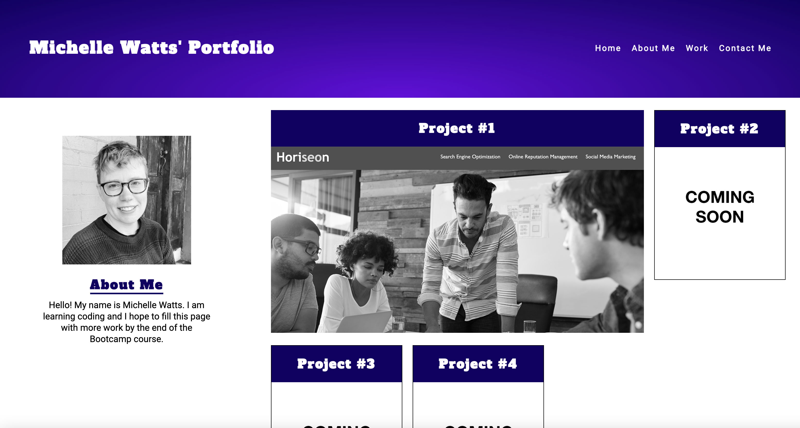

# Michelle Watts homework assignment week 2

Here is my assignment for week 2 of the Sydney Uni Bootcamp course. I have made a portfolio webpage that uses flexbox, css variables and media queries.
Links to the repo and the live page is below.

Link to GitHub page: https://michellewatts20000.github.io/portfolio-watts/.
Link to GitHub repo: https://github.com/michellewatts20000/portfolio-watts/.

